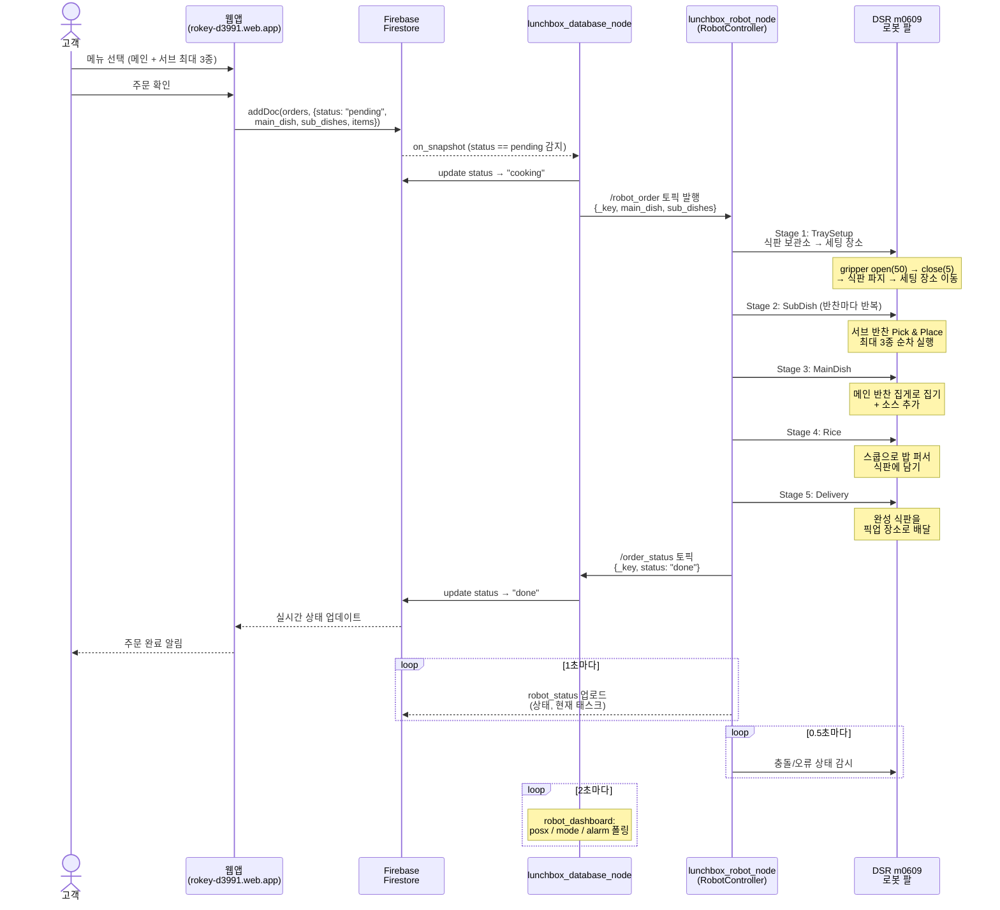

# 주문 처리 시퀀스 다이어그램

```mermaid
sequenceDiagram
    actor 고객
    participant WEB as 웹앱<br/>(rokey-d3991.web.app)
    participant FS as Firebase<br/>Firestore
    participant DB as lunchbox_database_node
    participant RC as lunchbox_robot_node<br/>(RobotController)
    participant DSR as DSR m0609<br/>로봇 팔

    %% ── 주문 접수 ──
    고객->>WEB: 메뉴 선택 (메인 + 서브 최대 3종)
    고객->>WEB: 주문 확인
    WEB->>FS: addDoc(orders, {status: "pending",<br/>main_dish, sub_dishes, items})

    %% ── Firebase → ROS2 ──
    FS-->>DB: on_snapshot (status == pending 감지)
    DB->>FS: update status → "cooking"
    DB->>RC: /robot_order 토픽 발행<br/>{_key, main_dish, sub_dishes}

    %% ── 로봇 동작 5단계 ──
    RC->>DSR: Stage 1: TraySetup<br/>식판 보관소 → 세팅 장소
    Note over DSR: gripper open(50) → close(5)<br/>→ 식판 파지 → 세팅 장소 이동

    RC->>DSR: Stage 2: SubDish (반찬마다 반복)
    Note over DSR: 서브 반찬 Pick & Place<br/>최대 3종 순차 실행

    RC->>DSR: Stage 3: MainDish
    Note over DSR: 메인 반찬 집게로 집기<br/>+ 소스 추가

    RC->>DSR: Stage 4: Rice
    Note over DSR: 스쿱으로 밥 퍼서<br/>식판에 담기

    RC->>DSR: Stage 5: Delivery
    Note over DSR: 완성 식판을<br/>픽업 장소로 배달

    %% ── 완료 처리 ──
    RC->>DB: /order_status 토픽<br/>{_key, status: "done"}
    DB->>FS: update status → "done"
    FS-->>WEB: 실시간 상태 업데이트
    WEB-->>고객: 주문 완료 알림

    %% ── 모니터링 (병렬) ──
    loop 1초마다
        RC-->>FS: robot_status 업로드<br/>(상태, 현재 태스크)
    end
    loop 0.5초마다
        RC->>DSR: 충돌/오류 상태 감시
    end
    loop 2초마다
        Note over DB: robot_dashboard:<br/>posx / mode / alarm 폴링
    end
```
