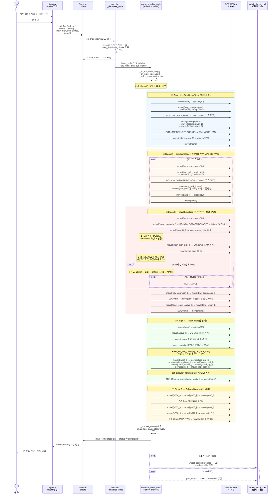
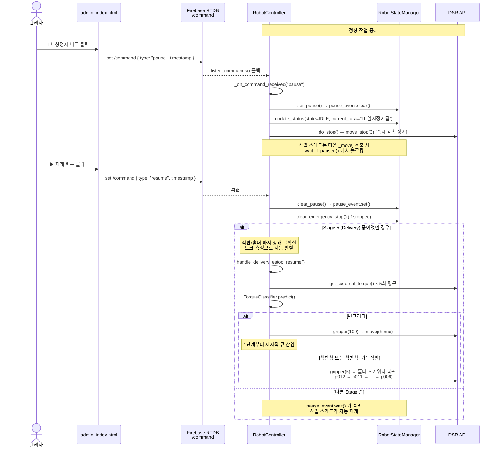
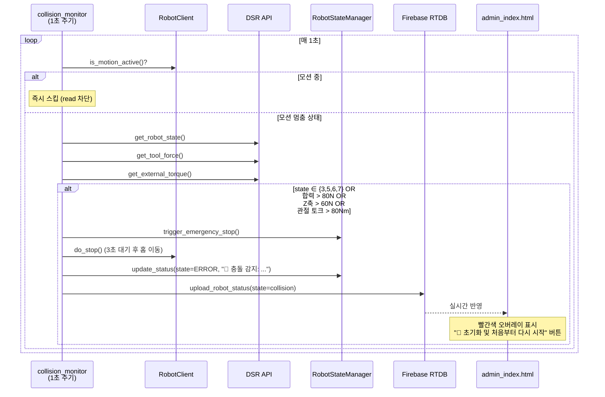
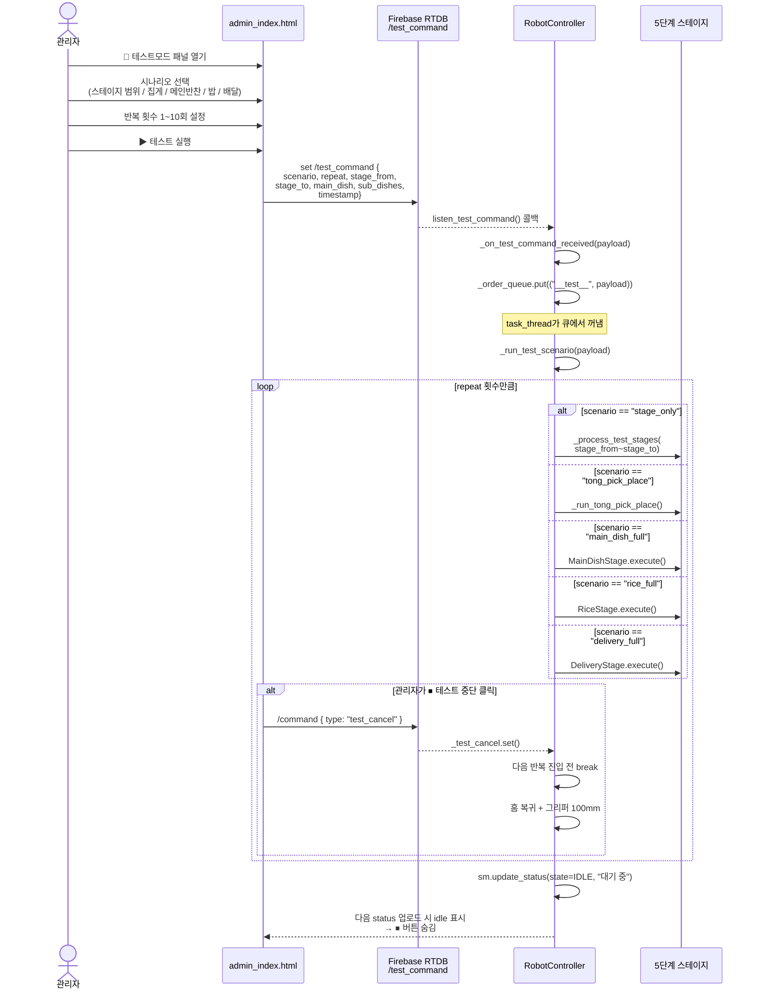
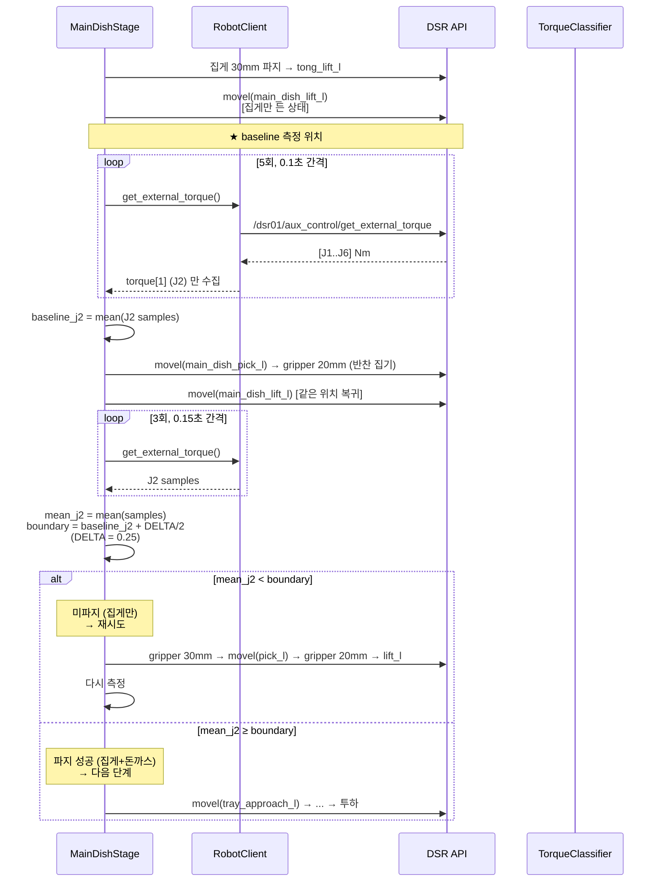

# 주문 처리 시퀀스 다이어그램

## 1. 정상 주문 처리 (전체 흐름)

---

## 2. 비상정지 및 재개 흐름

---

## 3. 자동 충돌 감지 흐름

---

## 4. 테스트 모드 흐름

---

## 5. 토크 기반 파지 판별 (Stage 3 핵심)

> **알고리즘 근거**: 집게만 들 때 J2 ≈ -3.38 Nm, 집게+돈까스(45g)일 때 J2 ≈ -3.06 Nm 로 약 0.32 Nm 차이. 자세별 절댓값이 달라지므로 **고정 임계값 대신 동적 baseline + delta** 방식을 채택하여 좌표 변경에도 강인하게 동작합니다. (자세한 내용은 [torque_classification_report.md](torque_classification_report.md) 참고)
